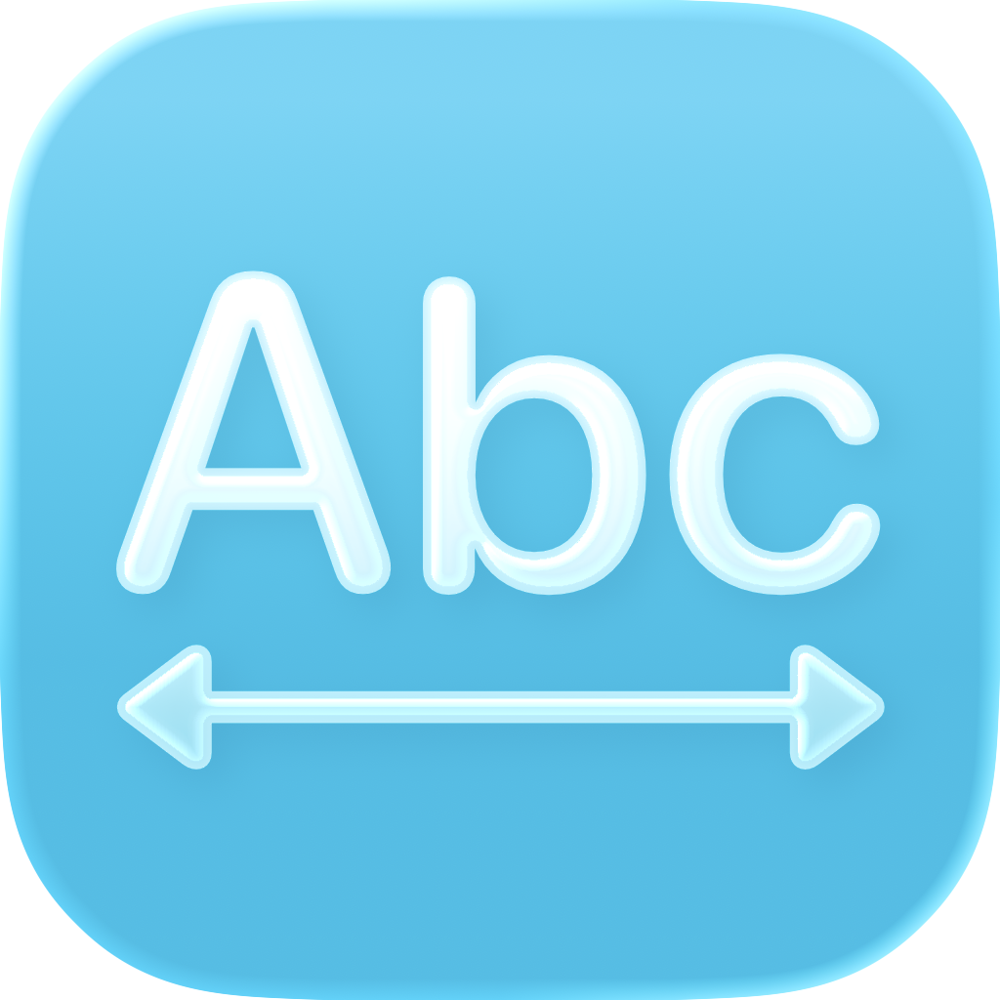

<div align="center">
  
  <h1><b>char</b></h1>
  <p>Minimal writing tool with live stats for characters, words, and more.<br>Native, optimized for speed, and private by design.</p>
</div>

<div align="center">
  <a href="https://github.com/851-labs/char/releases/latest">
    
  </a>
  
  <a href="https://github.com/851-labs/homebrew-tap">
    
  </a>
  <a href="https://github.com/851-labs/char/releases/latest/download/char.dmg">
    
  </a>
  <a href="https://github.com/851-labs/char/releases/latest">
    
  </a>
</div>

## 🖼️ Showcase

  

## 📦 Installation

### Direct Download

Download [the latest release](https://github.com/851-labs/char/releases/latest) and drag it to your Applications folder.

[](https://github.com/851-labs/char/releases/latest/download/char.dmg)

### Homebrew

```
brew install --cask 851-labs/tap/char
```

## 🛠️ Tech Stack

- [OpenCode](https://opencode.ai/) - AI Coding Agent
- [Swift 6.2](https://www.swift.org/)
- [SwiftUI](https://developer.apple.com/documentation/swiftui) - UI Framework
- [Sparkle](https://sparkle-project.org/) - Software Update Framework
- [Bun](https://bun.com/) - Scripts

## 📜 License

This project is released under the MIT License. See [LICENSE](LICENSE.md) for details.

## 🌟 Support

If you like this project, please consider giving it a star. ️
